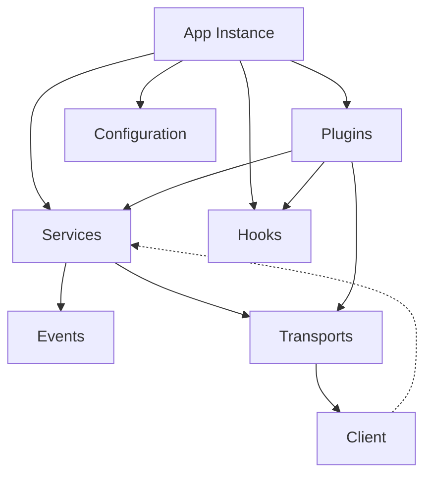

# API Reference

This section provides a detailed reference for the ScorpionJS API, covering the application instance, services, hooks, transports, configuration, and more.

---

## Core API Tables

---

### Architecture Overview



---

### App (Application Instance)

| Method/Property      | Type         | Description                                  |
|----------------------|--------------|----------------------------------------------|
| `service(path)`      | Function     | Get or register a service at the given path  |
| `configure(plugin)`  | Function     | Register a plugin/configure function         |
| `hooks(hooksObj)`    | Function     | Register global hooks                        |
| `listen(port)`       | Function     | Start the server on the specified port       |
| `get(path)`          | Function     | Get a configuration value                    |
| `set(path, value)`   | Function     | Set a configuration value                    |
| `on(event, handler)` | Function     | Listen to application-level events           |
| `emit(event, data)`  | Function     | Emit an application-level event              |

See: [Services API](./services.md), [Hooks API](./hooks.md), [Plugins & Extensions](./plugins.md), [Configuration API](./configuration.md)

---

### Service

| Method/Property      | Type         | Description                                  |
|----------------------|--------------|----------------------------------------------|
| `find(params)`       | Function     | Find multiple records                        |
| `get(id, params)`    | Function     | Retrieve a single record by ID               |
| `create(data, params)` | Function   | Create a new record                          |
| `update(id, data, params)` | Function | Replace a record by ID                    |
| `patch(id, data, params)` | Function  | Partially update a record by ID            |
| `remove(id, params)` | Function     | Remove a record by ID                        |
| `hooks(hooksObj)`    | Function     | Register hooks for this service              |
| `on(event, handler)` | Function     | Listen to service events                     |
| `emit(event, data)`  | Function     | Emit a service event                         |

See: [Services API](./services.md), [Hooks API](./hooks.md), [Events API](./events.md)

---

### Client

| Method/Property      | Type         | Description                                  |
|----------------------|--------------|----------------------------------------------|
| `service(path)`      | Function     | Get a remote service                         |
| `on(event, handler)` | Function     | Listen to client-level or service events      |
| `emit(event, data)`  | Function     | Emit a client-level event                    |
| `connect()`          | Function     | Connect to the server                        |
| `disconnect()`       | Function     | Disconnect from the server                   |

See: [Client API](./client.md), [Events API](./events.md)

---

## Table of Contents

- [Application](#application)
- [Services](#services)
- [Hooks](#hooks)
- [Schema Validation](#schema-validation)
- [Transports](#transports)
- [Fault Tolerance](#fault-tolerance)
- [Service Discovery](#service-discovery)
- [Streams](#streams)
- [Client](#client)
- [Errors](#errors)

## Application

The Application is the main entry point for ScorpionJS.

### createApp(options)

Creates a new ScorpionJS application.

```javascript
import { createApp } from 'scorpionjs';

const app = createApp({
  // Configuration options
});
```

#### Options

| Option | Type | Description |
|--------|------|-------------|
| `transports` | Object | Configure transport mechanisms (REST, WebSockets) |
| `circuitBreaker` | Object | Circuit breaker configuration |
| `bulkhead` | Object | Bulkhead configuration |
| `retry` | Object | Retry configuration |
| `timeout` | Object | Timeout configuration |
| `discovery` | Object | Service discovery configuration |
| `logger` | Object | Logger configuration |

### app.service(path, service)

Registers a service at the specified path.

```javascript
app.service('messages', {
  async find(params) {
    return [];
  }
});
```

#### Parameters

| Parameter | Type | Description |
|-----------|------|-------------|
| `path` | String | The path to register the service under |
| `service` | Object | The service object or class |

### app.hooks(hooks)

Registers global hooks for all services.

```javascript
app.hooks({
  before: {
    all: [
      async context => {
        // Do something before all service methods
        return context;
      }
    ]
  }
});
```

### app.listen(port)

Starts the server on the specified port.

```javascript
app.listen(3000).then(() => {
  console.log('Server running at http://localhost:3000');
});
```

#### Parameters

| Parameter | Type | Description |
|-----------|------|-------------|
| `port` | Number | The port to listen on |

### app.configure(callback)

Configures the application with the provided callback.

```javascript
app.configure(app => {
  // Configure the application
  app.service('messages', { /* ... */ });
});
```
