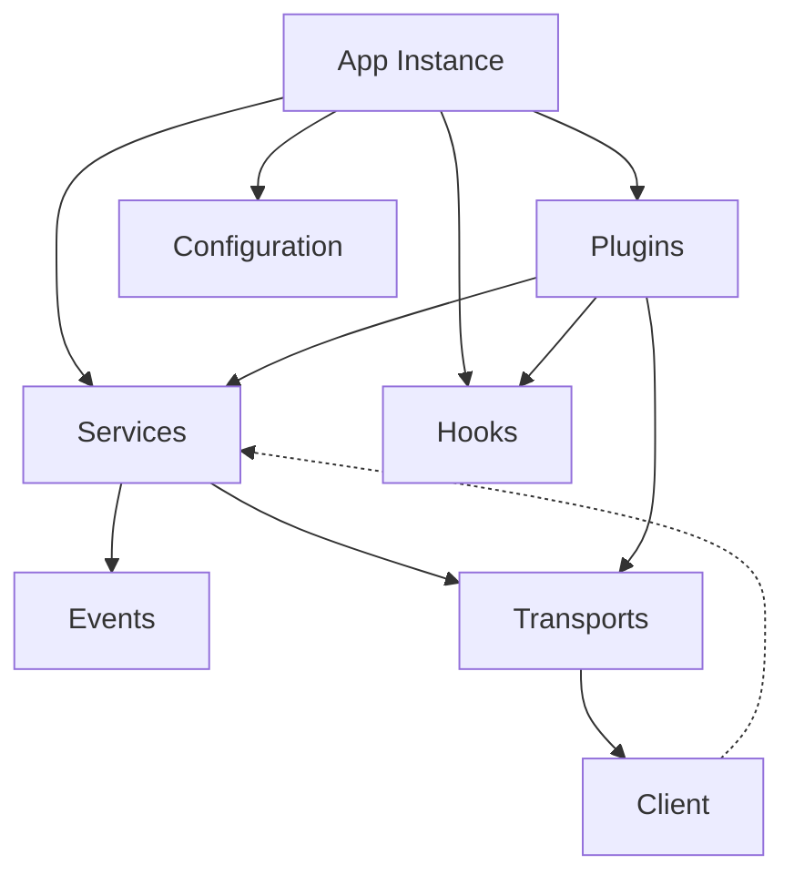

# API Reference

> Documentation for ScorpionJS v1.0.0

This section provides a detailed reference for the ScorpionJS API, covering the application instance, services, hooks, transports, configuration, and more.

---

## Core API Tables

---

### Architecture Overview



---

### App (Application Instance)

| Method/Property      | Type         | Returns      | Description                                  |
|----------------------|--------------|-------------|----------------------------------------------|
| `use(path, service, options?)` | Function | Application | Register a service at the given path with optional configurations | 
| `service(path)` | Function | Service     | Get a registered service at the given path  |
| `configure(plugin)`  | Function     | Application | Register a plugin/configure function         |
| `hooks(hooksObj)`    | Function     | Application | Register global hooks                        |
| `listen(port)`       | Function     | Promise<Server> | Start the server on the specified port    |
| `get(path)`          | Function     | any         | Get a configuration value                    |
| `set(path, value)`   | Function     | Application | Set a configuration value                    |
| `on(event, handler)` | Function     | Application | Listen to application-level events           |
| `emit(event, data)`  | Function     | boolean     | Emit an application-level event              |

See: [Services API](./services.md), [Hooks API](./hooks.md), [Plugins & Extensions](./plugins.md), [Configuration API](./configuration.md)

---

### Service

| Method/Property      | Type         | Returns      | Description                                  |
|----------------------|--------------|-------------|----------------------------------------------|
| `find(params)`       | Function     | Promise<any[]> | Find multiple records                     |
| `get(id, params)`    | Function     | Promise<any> | Retrieve a single record by ID              |
| `create(data, params)` | Function   | Promise<any> | Create a new record                         |
| `update(id, data, params)` | Function | Promise<any> | Replace a record by ID                   |
| `patch(id, data, params)` | Function  | Promise<any> | Partially update a record by ID           |
| `remove(id, params)` | Function     | Promise<any> | Remove a record by ID                       |
| `hooks(hooksObj)`    | Function     | Service     | Register hooks for this service             |
| `on(event, handler)` | Function     | Service     | Listen to service events                    |
| `emit(event, data)`  | Function     | boolean     | Emit a service event                        |

See: [Services API](./services.md), [Hooks API](./hooks.md), [Events API](./events.md)

---

### Client

| Method/Property      | Type         | Returns      | Description                                  |
|----------------------|--------------|-------------|----------------------------------------------|
| `service(path)`      | Function     | Service     | Get a remote service                         |
| `on(event, handler)` | Function     | Client      | Listen to client-level or service events      |
| `emit(event, data)`  | Function     | boolean     | Emit a client-level event                    |
| `connect()`          | Function     | Promise<Client> | Connect to the server                    |
| `disconnect()`       | Function     | Promise<void> | Disconnect from the server                 |

See: [Client API](./client.md), [Events API](./events.md)

---

## Table of Contents

- [Application](#application)
- [Services](#services)
- [Hooks](#hooks)
- [Schema Validation](#schema-validation)
- [Transports](#transports)
- [Fault Tolerance](#fault-tolerance)
- [Service Discovery](#service-discovery)
- [Streams](#streams)
- [Client](#client)
- [Errors](#errors)
- [TypeScript Support](./typescript.md)
- [Performance Optimization](./performance.md)
- [Security Best Practices](./security.md)
- [Testing](./testing.md)
- [Plugins & Extensions](./plugins.md)
- [Contributing](./contributing.md)

## Application

The Application is the main entry point for ScorpionJS.

### createApp(options)

Creates a new ScorpionJS application.

```javascript
import { createApp } from 'scorpionjs';

const app = createApp({
  // Configuration options
});
```

#### Options

| Option | Type | Description |
|--------|------|-------------|
| `transports` | Object | Configure transport mechanisms (REST, WebSockets) |
| `circuitBreaker` | Object | Circuit breaker configuration |
| `bulkhead` | Object | Bulkhead configuration |
| `retry` | Object | Retry configuration |
| `timeout` | Object | Timeout configuration |
| `discovery` | Object | Service discovery configuration |
| `logger` | Object | Logger configuration |

### app.use(path, service, options?)

Registers a service at the specified path, with optional service-specific configurations.

```javascript
// Simple registration
app.use('messages', {
  async find(params) {
    return [];
  }
});

// Registration with options (e.g., for service-specific validator or schemas)
app.use('another-service', new MyServiceClass(), {
  validator: myCustomValidator,
  schemas: { create: myCreateSchema }
});
```

#### Parameters

| Parameter | Type | Description |
|-----------|------|-------------|
| `path` | String | The path to register the service under |
| `service` | Object/Class | The service object or class instance |
| `options` (optional) | Object | Service-specific configurations (e.g., `validator`, `schemas`, `events`) |

### app.hooks(hooks)

Registers global hooks for all services.

```javascript
app.hooks({
  before: {
    all: [
      async context => {
        // Do something before all service methods
        return context;
      }
    ]
  }
});
```

### app.listen(port)

Starts the server on the specified port.

```javascript
app.listen(3000).then(() => {
  console.log('Server running at http://localhost:3000');
});
```

#### Parameters

| Parameter | Type | Description |
|-----------|------|-------------|
| `port` | Number | The port to listen on |

### app.configure(callback)

Configures the application with the provided callback.

```javascript
app.configure(app => {
  // Configure the application
  app.use('messages', { /* ... */ });
});
```
