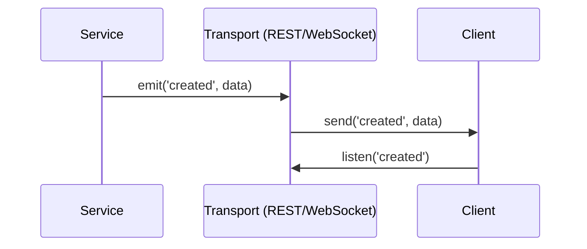

# Events API

ScorpionJS provides a powerful event system that allows services to communicate with each other through events. This document provides detailed API documentation for using events in ScorpionJS.

---

### Event Flow Diagram



---
## Introduction to Events

Events in ScorpionJS enable loose coupling between services, allowing them to react to changes without direct dependencies. The event system is built on top of Node.js's EventEmitter but extends it with additional features like distributed events across nodes.

## Basic Event Usage

### Emitting Events

Services automatically emit events when standard methods are called:

```javascript
import { createApp } from 'scorpionjs';

const app = createApp();

app.service('messages', {
  async create(data, params) {
    // Create a new message
    const message = {
      id: Date.now(),
      text: data.text,
      createdAt: new Date()
    };
    
    // Return the message
    // This will automatically emit a 'created' event
    return message;
  }
});

// Start the server
app.listen(3000);
```

### Listening to Events

```javascript
// Listen to service events
app.service('messages').on('created', message => {
  console.log('A message was created:', message);
});

// Listen to all 'created' events
app.on('messages created', message => {
  console.log('A message was created:', message);
});

// Listen to all service events
app.on('*', (eventName, data) => {
  console.log(`Event ${eventName} was emitted with data:`, data);
});
```

### Event Listener Cleanup

ScorpionJS automatically cleans up event listeners when a service is unregistered using `app.unservice()`. This prevents memory leaks and ensures that event listeners don't persist after a service is removed.

```javascript
// Register a service
app.service('messages', messageService);

// Add event listeners
app.service('messages').on('created', handleMessageCreated);
app.on('messages created', handleGlobalMessageCreated);

// Later, unregister the service
app.unservice('messages');
// All event listeners for the 'messages' service are automatically removed
```

## Standard Service Events

ScorpionJS services automatically emit events for standard methods. The event emission happens in the `executeServiceCall` method after successful execution of the service method. This ensures that events are emitted regardless of how the service is called (REST, WebSockets, or direct method calls). See [Services API](./services.md) for more details.

| Method | Event | Data |
|--------|-------|------|
| `create` | `created` | The created item |
| `update` | `updated` | The updated item |
| `patch` | `patched` | The patched item |
| `remove` | `removed` | The removed item |

Events are emitted both at the service level and globally on the app instance with the service path as a prefix.

## Custom Method Events

ScorpionJS also supports automatic event emission for custom service methods. When a custom method is called, an event is automatically emitted with the method name + 'ed' as the event name:

```javascript
// Service with a custom method
app.service('calculator', {
  async calculateTotal(data) {
    const result = { 
      total: data.items.reduce((sum, item) => sum + item.price, 0),
      itemCount: data.items.length
    };
    return result;
    // Automatically emits 'calculateTotaled' event with result as data
  }
});

// Listen to the automatic custom method event
app.service('calculator').on('calculateTotaled', (data) => {
  console.log('Calculation completed:', data);
});
```

This automatic event emission for custom methods follows the same pattern as standard methods, making the event system consistent across all service methods.

## Manual Custom Events

In addition to automatic event emission, you can also manually emit custom events with any name of your choice. This gives you full control over when events are emitted and what data they contain:

```javascript
// Service with manually emitted custom events
app.service('payments', {
  async processPayment(data, params) {
    // Process payment logic
    const result = await processPayment(data);
    
    // Manually emit a custom event with a specific name
    this.emit('payment_processed', {
      amount: data.amount,
      status: result.status,
      transactionId: result.id
    });
    
    // You can emit multiple events from a single method
    if (result.status === 'success') {
      this.emit('payment_succeeded', { transactionId: result.id });
    }
    
    return result;
    // The method will ALSO automatically emit 'processPaymented' event
  }
});

// Listen to manually emitted custom events
app.service('payments').on('payment_processed', data => {
  console.log('Payment processed:', data);
});

// Listen to the automatic event
app.service('payments').on('processPaymented', result => {
  console.log('Payment method completed:', result);
});
```

Manual event emission is particularly useful when you need to:

1. Emit events at specific points during method execution (not just after completion)
2. Emit multiple events from a single method
3. Use custom event names that better describe specific actions or states
4. Include different data than what the method returns

## Event Context

Events include additional context information:

```javascript
app.service('messages').on('created', (message, context) => {
  console.log('Message:', message);
  console.log('Service:', context.service);
  console.log('Method:', context.method);
  console.log('Path:', context.path);
  console.log('Result:', context.result);
  console.log('Params:', context.params);
});
```

## Event Filters

You can filter events based on certain criteria:

```javascript
// Filter events by user
app.service('messages').on('created', (message, context) => {
  // Only react to messages created by a specific user
  if (context.params.user && context.params.user.id === '123') {
    console.log('User 123 created a message:', message);
  }
});

// Filter events using a filter function
app.service('messages').filter('created', (message, context) => {
  // Only emit events for public messages
  return message.public === true;
});
```

## Event Channels

ScorpionJS provides event channels for real-time communication:

```javascript
app.configure(channels());

// Define a channel for authenticated users
app.channel('authenticated').join(connection => {
  // Join this channel if the connection is authenticated
  return connection.authenticated;
});

// Define a channel for specific rooms
app.channel('rooms').join(connection => {
  // Join all rooms this connection is interested in
  return connection.rooms || [];
});

// Publish service events to channels
app.service('messages').publish((data, context) => {
  // Publish created events to the room channel
  if (context.method === 'create') {
    return app.channel(`rooms/${data.roomId}`);
  }
  
  // Publish all events to authenticated users
  return app.channel('authenticated');
});
```

## Distributed Events

ScorpionJS supports distributed events across multiple nodes:

```javascript
import { createApp } from 'scorpionjs';
import redis from 'scorpionjs-redis';

const app = createApp({
  events: {
    adapter: 'redis',
    options: {
      host: 'localhost',
      port: 6379
    }
  }
});

// Configure Redis for distributed events
app.configure(redis());

// Events will now be distributed across all nodes
app.service('messages').on('created', message => {
  console.log('Message created on any node:', message);
});
```

## Event Adapters

ScorpionJS supports different event adapters:

### Memory Adapter (Default)

```javascript
const app = createApp({
  events: {
    adapter: 'memory'
  }
});
```

### Redis Adapter

```javascript
const app = createApp({
  events: {
    adapter: 'redis',
    options: {
      host: 'localhost',
      port: 6379,
      password: 'secret',
      db: 0,
      keyPrefix: 'scorpion:events:'
    }
  }
});
```

### MQTT Adapter

```javascript
const app = createApp({
  events: {
    adapter: 'mqtt',
    options: {
      url: 'mqtt://localhost:1883',
      clientId: 'scorpion-app',
      topic: 'scorpion/events'
    }
  }
});
```

### Custom Adapter

```javascript
import { createApp, EventAdapter } from 'scorpionjs';

// Create a custom event adapter
class MyCustomEventAdapter extends EventAdapter {
  constructor(options) {
    super(options);
    this.options = options;
  }
  
  async init(app) {
    this.app = app;
    // Initialize your event adapter
  }
  
  async publish(event, data) {
    // Publish an event
    console.log(`Publishing event ${event}:`, data);
  }
  
  async subscribe(event, handler) {
    // Subscribe to an event
    console.log(`Subscribing to event ${event}`);
    return () => {
      // Return unsubscribe function
      console.log(`Unsubscribing from event ${event}`);
    };
  }
  
  async close() {
    // Clean up resources
  }
}

// Register the custom event adapter
const app = createApp({
  events: {
    adapter: 'custom',
    strategy: MyCustomEventAdapter,
    options: {
      // Custom options
    }
  }
});
```

## Event Patterns

### Pub/Sub Pattern

```javascript
// Publisher service
app.service('notifications', {
  async create(data, params) {
    // Create notification
    const notification = {
      id: Date.now(),
      message: data.message,
      type: data.type,
      createdAt: new Date()
    };
    
    // Store notification
    this.notifications.push(notification);
    
    // Return notification (will emit 'created' event)
    return notification;
  },
  
  setup(app) {
    this.notifications = [];
  }
});

// Subscriber services
app.service('email').on('notifications created', async notification => {
  if (notification.type === 'email') {
    await sendEmail(notification);
  }
});

app.service('push').on('notifications created', async notification => {
  if (notification.type === 'push') {
    await sendPushNotification(notification);
  }
});

app.service('sms').on('notifications created', async notification => {
  if (notification.type === 'sms') {
    await sendSMS(notification);
  }
});
```

### Event Sourcing

```javascript
// Event store service
app.service('events', {
  async create(data, params) {
    // Store event
    const event = {
      id: Date.now(),
      type: data.type,
      payload: data.payload,
      metadata: {
        userId: params.user?.id,
        timestamp: new Date()
      }
    };
    
    // Store event
    this.events.push(event);
    
    // Return event
    return event;
  },
  
  setup(app) {
    this.events = [];
  }
});

// Aggregate services
app.service('users').on('events created', async event => {
  if (event.type === 'user_created') {
    await this.create(event.payload);
  } else if (event.type === 'user_updated') {
    await this.patch(event.payload.id, event.payload);
  } else if (event.type === 'user_deleted') {
    await this.remove(event.payload.id);
  }
});
```

## Event Hooks

You can use hooks to modify events before they are emitted:

```javascript
// Add a hook to modify events
app.service('messages').hooks({
  before: {
    all: [
      async context => {
        // Add a timestamp to the context
        context.timestamp = new Date();
        return context;
      }
    ]
  },
  
  after: {
    create: [
      async context => {
        // Modify the event data
        context.event = {
          ...context.result,
          processed: true
        };
        return context;
      }
    ]
  }
});
```

## Event Middleware

You can add middleware to process events:

```javascript
// Add event middleware
app.use('events', (event, next) => {
  // Log all events
  console.log(`Event ${event.name} emitted:`, event.data);
  next();
});

// Add middleware for specific events
app.use('messages created', (event, next) => {
  // Process message created events
  console.log('Message created:', event.data);
  next();
});
```

## Event Batching

You can batch events for better performance:

```javascript
import { createApp } from 'scorpionjs';
import eventBatcher from 'scorpionjs-event-batcher';

const app = createApp();

// Configure event batching
app.configure(eventBatcher({
  batchSize: 100,    // Batch size
  timeout: 1000,     // Batch timeout in ms
  events: ['created', 'updated', 'patched', 'removed']
}));

// Listen to batched events
app.on('messages created batch', messages => {
  console.log(`Received batch of ${messages.length} created messages`);
});
```

## Event Debugging

ScorpionJS provides tools for debugging events:

```javascript
import { createApp } from 'scorpionjs';
import eventDebugger from 'scorpionjs-event-debugger';

const app = createApp();

// Configure event debugger
app.configure(eventDebugger({
  console: true,     // Log events to console
  file: './events.log',  // Log events to file
  filter: event => event.name !== 'ping'  // Filter events
}));
```

## Client-side Events

ScorpionJS client can also listen to events:

```javascript
import { createClient } from 'scorpionjs/client';

// Create a client
const client = createClient('http://localhost:3000');

// Listen to service events
client.service('messages').on('created', message => {
  console.log('Message created:', message);
});

// Listen to all service events
client.on('messages created', message => {
  console.log('Message created:', message);
});
```

## Implementation Details

The ScorpionJS event system is implemented using Node.js's built-in `EventEmitter` class. Here's how it works internally:

1. **Service Registration**: When a service is registered with `app.service()`, it's dynamically extended with event methods (`emit`, `on`, `off`) if they don't already exist.

2. **Event Tracking**: All event listeners are tracked in a `serviceEventListeners` object on the app instance, indexed by service path. This enables proper cleanup when services are unregistered.

3. **Automatic Event Emission**: The `executeServiceCall` method automatically emits events for standard service methods (`create`, `update`, `patch`, `remove`) after successful execution. This ensures consistent event behavior regardless of how services are accessed.

4. **Event Namespacing**: Events are namespaced by combining the service path with the event name (e.g., `messages created`) when emitted globally on the app instance.

5. **Event Context**: Events include context information such as the service instance, path, and other relevant metadata.

6. **Cleanup on Unregistration**: When `app.unservice()` is called, all event listeners associated with that service are automatically removed to prevent memory leaks.

## Advanced Topics

### Event Replay

```javascript
// Replay events from a specific point
const events = await app.service('events').find({
  query: {
    timestamp: {
      $gt: new Date('2023-01-01')
    },
    $sort: {
      timestamp: 1
    }
  }
});

// Process events
for (const event of events) {
  await processEvent(event);
}
```

### Event Versioning

```javascript
// Emit versioned events
app.service('users').emit('user.created.v1', user);

// Listen to specific versions
app.service('users').on('user.created.v1', user => {
  // Handle v1 events
});

app.service('users').on('user.created.v2', user => {
  // Handle v2 events
});
```

### Event Schemas

```javascript
import { createApp } from 'scorpionjs';
import eventSchema from 'scorpionjs-event-schema';

const app = createApp();

// Configure event schemas
app.configure(eventSchema({
  'messages created': {
    type: 'object',
    required: ['id', 'text'],
    properties: {
      id: { type: 'number' },
      text: { type: 'string' },
      createdAt: { type: 'string', format: 'date-time' }
    }
  }
}));
```

### Event Persistence

```javascript
import { createApp } from 'scorpionjs';
import eventStore from 'scorpionjs-event-store';

const app = createApp();

// Configure event persistence
app.configure(eventStore({
  service: 'event-store',
  events: ['created', 'updated', 'patched', 'removed']
}));
```
